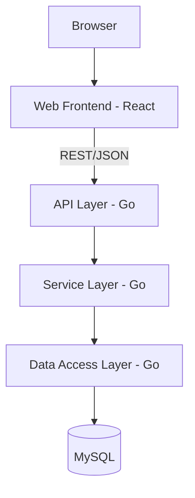
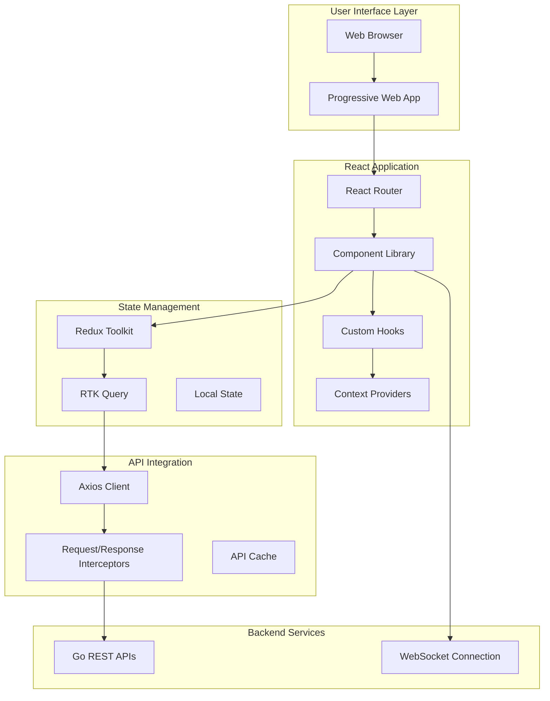
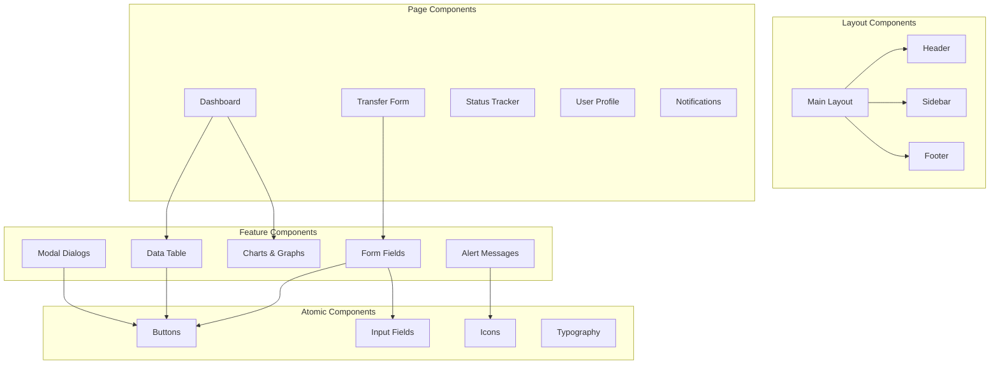
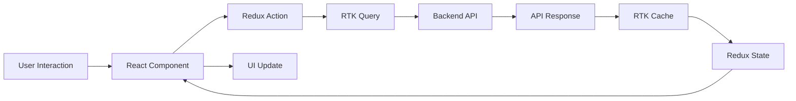
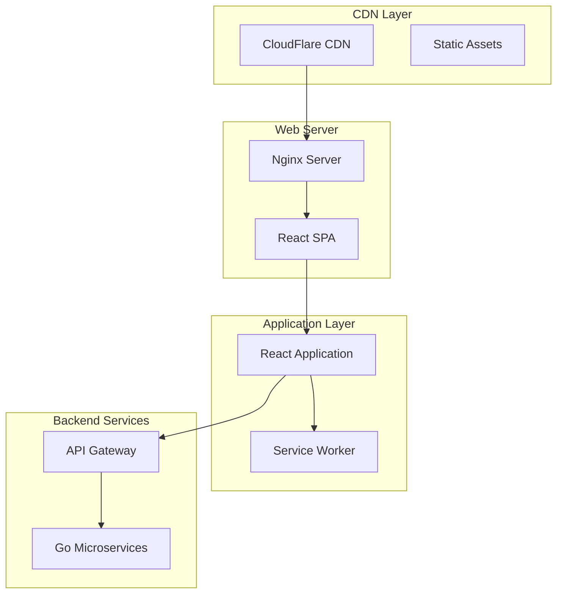
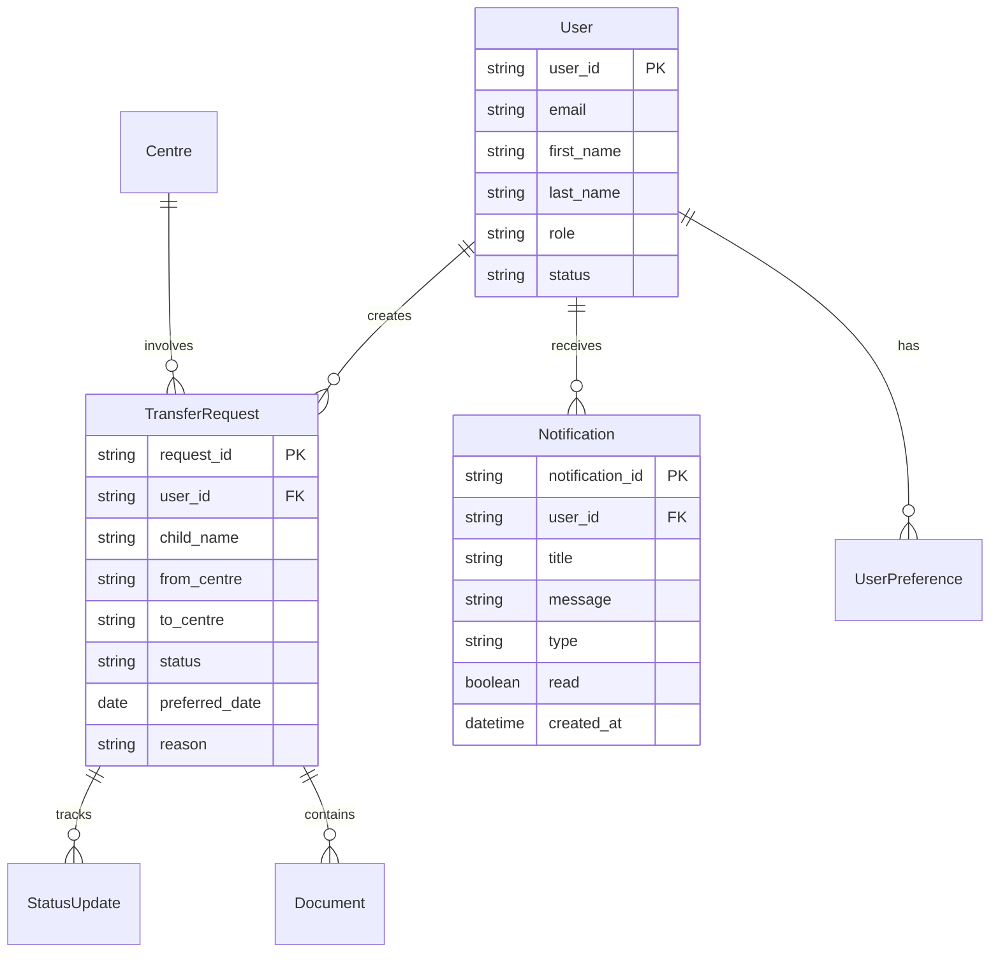
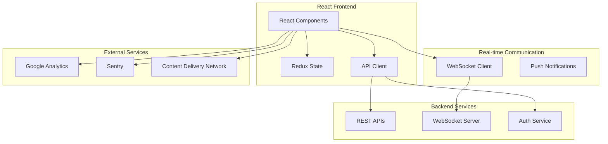

# High Level Design - Frontend - Development Phase - 1 - Frontend Development Phase



## 1. Executive Summary

### 1.1. Objective
This HLD defines the comprehensive frontend architecture for the NTUC First Campus transfer request platform. The objective is to develop responsive web interfaces for parents and staff, including transfer request forms, real-time status tracking, dashboards for review/approval, notification settings, and onboarding guides. The frontend will provide an intuitive, accessible, and mobile-responsive user experience that integrates seamlessly with the Go backend APIs.

### 1.2. Scope
**In-scope:**
- React web application development for Parent Portal and Staff Portal
- Responsive design for mobile and desktop devices
- Real-time status tracking and notifications
- Form validation and user input handling
- Dashboard interfaces for different user roles
- Integration with backend REST APIs
- Accessibility compliance (WCAG 2.1 AA)
- Cross-browser compatibility

**Out-of-scope:**
- Backend API development
- Database design and implementation
- Mobile native applications
- Third-party service integrations
- Infrastructure and deployment

### 1.3. Key Stakeholders
- Frontend Development Team (React developers)
- UX/UI Design Team
- Backend Development Team (Go developers)
- Product Owner
- Quality Assurance Team
- End Users (Parents, Principals, Staff)

## 2. Solution Overview

### 2.1. Architecture Vision
The frontend architecture follows modern React best practices with a component-based approach, utilizing hooks for state management, and implementing a scalable folder structure. The application will be built as a Single Page Application (SPA) with client-side routing, optimized for performance and user experience across all devices and browsers.

### 2.2. High-Level Architecture Diagram


### 2.3. Technology Stack
| Layer | Technology | Justification |
|-------|-----------|---------------|
| Frontend Framework | React 18 | Enterprise standard, component-based architecture |
| State Management | Redux Toolkit | Predictable state management, DevTools |
| API Client | RTK Query | Efficient data fetching and caching |
| Routing | React Router v6 | Standard React routing solution |
| UI Components | Material-UI (MUI) | Comprehensive component library |
| Form Handling | React Hook Form | Performance-optimized form library |
| Validation | Yup | Schema-based validation |
| Testing | Jest + React Testing Library | Comprehensive testing framework |
| Build Tool | Vite | Fast build tool and dev server |
| Styling | Styled Components + MUI Theme | CSS-in-JS with theming support |

### 2.4. Key Design Decisions
| Decision | Options Considered | Selected Option | Rationale |
|----------|-------------------|-----------------|-----------|
| State Management | Context API vs Redux Toolkit | Redux Toolkit | Complex state, time-travel debugging |
| API Client | Axios vs Fetch vs RTK Query | RTK Query | Built-in caching, loading states |
| UI Library | Material-UI vs Ant Design vs Custom | Material-UI | Mature ecosystem, accessibility |
| Form Library | Formik vs React Hook Form | React Hook Form | Better performance, less re-renders |

## 3. System Architecture

### 3.1. Component Architecture

#### 3.1.1 Component Diagram


#### 3.1.2 Component Descriptions
| Component | Responsibility | Technology | Existing/New |
|-----------|---------------|------------|--------------|
| Layout System | Application structure and navigation | React + MUI | New |
| Form Components | User input and validation | React Hook Form + Yup | New |
| Data Visualization | Charts and analytics display | Recharts + MUI | New |
| Notification System | Real-time alerts and messages | React + WebSocket | New |
| Authentication | User login and session management | React + JWT | New |

### 3.2. Data Flow Overview


### 3.3. Deployment Architecture

#### 3.3.1 Deployment Diagram


#### 3.3.2 Environment Overview
| Environment | Purpose | Infrastructure |
|-------------|---------|----------------|
| Development | Local development | Vite dev server, mock APIs |
| Staging | Integration testing | Nginx, real backend APIs |
| Production | Live user environment | CDN, load balancer, optimized build |

## 4. Backend Architecture (Go)

### 4.1. Application Layering
The frontend integrates with Go backend through well-defined API contracts:
- **API Gateway**: Centralized entry point for all frontend requests
- **Authentication Service**: JWT token validation and user sessions
- **Business Services**: Core application logic and data processing
- **WebSocket Service**: Real-time notifications and updates

### 4.2. Module Structure
| Module | Responsibility | Key Dependencies |
|--------|---------------|------------------|
| API Client | Backend communication | Axios, RTK Query |
| Authentication | User session management | JWT, localStorage |
| WebSocket | Real-time updates | Socket.io client |
| Error Handling | API error management | Custom error boundaries |

### 4.3. API Strategy

#### 4.3.1 Principles
- RESTful API consumption with consistent patterns
- Optimistic updates with rollback capability
- Request/response interceptors for common logic
- Automatic retry mechanisms for failed requests
- Comprehensive error handling and user feedback

#### 4.3.2 API Summary
| Domain | Frontend Module | API Endpoints | Purpose |
|--------|----------------|---------------|---------|
| Authentication | AuthService | POST /api/v1/auth/login | User authentication |
| Transfers | TransferService | GET/POST/PUT /api/v1/transfers | Transfer management |
| Users | UserService | GET/PUT /api/v1/users | User profile management |
| Notifications | NotificationService | GET/POST /api/v1/notifications | Notification handling |
| Reports | ReportService | GET /api/v1/reports | Analytics and reporting |

### 4.4. Error Handling Strategy
- Global error boundary for unhandled exceptions
- API error interceptors with user-friendly messages
- Retry logic for network failures
- Offline detection and graceful degradation
- Loading states and error feedback for all operations

## 5. Frontend Architecture (React)

### 5.1. Application Structure
```
src/
├── components/
│   ├── common/           # Reusable components
│   ├── forms/           # Form-specific components
│   ├── layout/          # Layout components
│   └── ui/              # UI atomic components
├── pages/
│   ├── Dashboard/       # Dashboard page
│   ├── Transfers/       # Transfer-related pages
│   ├── Profile/         # User profile pages
│   └── Auth/            # Authentication pages
├── hooks/
│   ├── useAuth.js       # Authentication hook
│   ├── useApi.js        # API interaction hook
│   └── useWebSocket.js  # WebSocket hook
├── services/
│   ├── api.js           # API client configuration
│   ├── auth.js          # Authentication service
│   └── websocket.js     # WebSocket service
├── store/
│   ├── slices/          # Redux slices
│   ├── api/             # RTK Query APIs
│   └── index.js         # Store configuration
├── utils/
│   ├── constants.js     # Application constants
│   ├── helpers.js       # Utility functions
│   └── validators.js    # Validation schemas
├── styles/
│   ├── theme.js         # MUI theme configuration
│   └── globals.css      # Global styles
└── App.js               # Root application component
```

### 5.2. Component Strategy
**Container Components (Smart Components):**
- Manage state and business logic
- Connect to Redux store
- Handle API calls and side effects
- Pass data to presentational components

**Presentational Components (Dumb Components):**
- Focus on UI rendering
- Receive data through props
- Emit events through callbacks
- Reusable across different contexts

**Custom Hooks:**
- Extract reusable logic
- Manage component lifecycle
- Handle complex state operations
- Provide clean API for components

### 5.3. State Management Approach
**Global State (Redux Toolkit):**
- User authentication state
- Application-wide settings
- Cached API responses
- UI state that needs persistence

**Local State (useState/useReducer):**
- Component-specific UI state
- Form input values
- Temporary data
- Component lifecycle state

**Server State (RTK Query):**
- API response caching
- Loading and error states
- Automatic refetching
- Optimistic updates

### 5.4. Routing Strategy
```javascript
// Route structure
/                          # Dashboard (authenticated users)
/login                     # Login page
/transfers                 # Transfer list
/transfers/new             # New transfer form
/transfers/:id             # Transfer details
/transfers/:id/edit        # Edit transfer
/profile                   # User profile
/notifications             # Notification center
/reports                   # Analytics dashboard
/help                      # Help and support
```

**Route Protection:**
- Private routes requiring authentication
- Role-based route access control
- Redirect to login for unauthenticated users
- Deep linking support with state restoration

### 5.5. Key Screens/Modules
| Screen/Module | Purpose | Key Interactions |
|---------------|---------|------------------|
| Dashboard | Overview of user's transfers and activities | Status cards, recent activity, quick actions |
| Transfer Form | Submit new transfer requests | Multi-step form, validation, file upload |
| Transfer List | View and manage transfer requests | Filtering, sorting, pagination, bulk actions |
| Status Tracker | Real-time transfer status updates | Timeline view, status changes, notifications |
| Principal Dashboard | Review and approve transfers | Approval workflow, bulk operations, reporting |
| Notification Center | Manage alerts and preferences | Mark as read, filter by type, settings |
| User Profile | Manage account settings | Personal info, preferences, security settings |
| Help Center | Self-service support | Search, categories, FAQ, contact form |

## 6. Data Architecture

### 6.1. Data Model Overview


### 6.2. Key Entities
| Entity | Description | Frontend Usage |
|--------|-------------|----------------|
| User | System users with roles and permissions | Authentication, profile management |
| TransferRequest | Transfer applications with status | Main business entity, forms, lists |
| Notification | User notifications and alerts | Real-time updates, notification center |
| StatusUpdate | Transfer status history | Timeline views, audit trail |

### 6.3. Data Storage Strategy
**Frontend Data Management:**
- Redux store for application state
- RTK Query cache for API responses
- localStorage for user preferences
- sessionStorage for temporary data
- IndexedDB for offline capabilities

**API Response Caching:**
- Automatic caching with RTK Query
- Cache invalidation strategies
- Background refetching
- Optimistic updates with rollback

### 6.4. Data Migration Approach
- Gradual migration from existing systems
- Data validation on the frontend
- Fallback mechanisms for missing data
- User communication during transitions

## 7. Integration Architecture

### 7.1. Integration Overview Diagram


### 7.2. External Systems
| System | Purpose | Integration Pattern | Protocol |
|--------|---------|-------------------|----------|
| Go Backend APIs | Core business logic | REST API calls | HTTPS/JSON |
| WebSocket Server | Real-time updates | WebSocket connection | WSS |
| Google Analytics | User behavior tracking | JavaScript SDK | HTTPS |
| Sentry | Error monitoring | JavaScript SDK | HTTPS |

### 7.3. Integration Patterns Used
- **API Gateway Pattern**: Centralized API access through single endpoint
- **Observer Pattern**: Real-time updates through WebSocket subscriptions
- **Circuit Breaker**: Graceful degradation for API failures
- **Retry Pattern**: Automatic retry for failed requests
- **Cache-Aside**: Client-side caching with RTK Query

## 8. Security Architecture

### 8.1. Authentication Approach
- JWT-based authentication with refresh tokens
- Secure token storage in httpOnly cookies
- Automatic token refresh before expiration
- Logout functionality with token invalidation
- Session timeout handling

### 8.2. Authorization Model
- Role-based access control (RBAC) in UI
- Route-level authorization checks
- Component-level permission rendering
- API-level authorization validation
- Principle of least privilege

### 8.3. Data Protection Strategy
- Input sanitization and validation
- XSS prevention through React's built-in protection
- CSRF protection with secure headers
- Secure communication over HTTPS
- Content Security Policy (CSP) implementation

### 8.4. Security Controls
| Control | Implementation Approach |
|---------|------------------------|
| Input Validation | Client-side validation with Yup schemas |
| XSS Prevention | React's built-in escaping, CSP headers |
| CSRF Protection | CSRF tokens, SameSite cookies |
| Authentication | JWT tokens, secure storage |
| Authorization | Role-based UI rendering, API validation |

## 9. Non-Functional Requirements

### 9.1. Performance
- Initial page load time < 3 seconds
- Route transitions < 500ms
- API response handling < 200ms
- Bundle size optimization with code splitting
- Image optimization and lazy loading

### 9.2. Scalability
- Component-based architecture for reusability
- Code splitting for optimal bundle sizes
- Lazy loading for non-critical components
- Efficient state management with normalized data
- CDN utilization for static assets

### 9.3. Availability
- Offline capability with service workers
- Graceful degradation for API failures
- Error boundaries for component failures
- Retry mechanisms for network issues
- Progressive Web App (PWA) features

### 9.4. Logging & Monitoring Strategy
- Error tracking with Sentry
- Performance monitoring with Web Vitals
- User analytics with Google Analytics
- Custom event tracking for business metrics
- Console logging for development debugging

## 10. Risks & Mitigations
| Risk | Impact | Likelihood | Mitigation |
|------|--------|------------|------------|
| Browser compatibility issues | Medium | Low | Comprehensive testing, polyfills |
| Performance degradation | High | Medium | Code splitting, optimization, monitoring |
| Security vulnerabilities | High | Low | Regular security audits, dependency updates |
| API integration failures | High | Medium | Error handling, retry logic, fallbacks |
| User experience issues | Medium | Medium | User testing, accessibility compliance |

## 11. Assumptions & Constraints

### 11.1. Assumptions
- Users have modern browsers (Chrome, Firefox, Safari, Edge)
- Stable internet connectivity for real-time features
- Backend APIs are available and reliable
- Design system components are provided
- User acceptance testing will be conducted

### 11.2. Constraints
- Must support IE11 (if required by organization)
- Limited budget for premium UI libraries
- Integration with existing authentication system
- Compliance with accessibility standards
- Mobile-first responsive design requirement

### 11.3. Dependencies
- Backend API development completion
- Design system and UI components
- Authentication service integration
- Content and copy for all screens
- User acceptance testing coordination

## 12. Confirmation Needed
**What was decided:** React SPA with Redux Toolkit and Material-UI
**Why:** Provides scalable architecture with modern development practices
**Impact if wrong:** Potential performance issues and development complexity
**How to correct:** Implement performance monitoring and be prepared to optimize

## 13. Appendix

### 13.1. Glossary
- **SPA**: Single Page Application
- **PWA**: Progressive Web App
- **RTK**: Redux Toolkit
- **CSP**: Content Security Policy
- **JWT**: JSON Web Token
- **RBAC**: Role-Based Access Control

Approval status: APPROVED