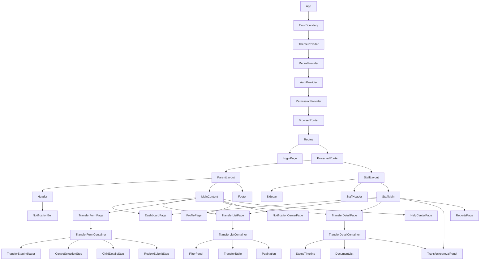
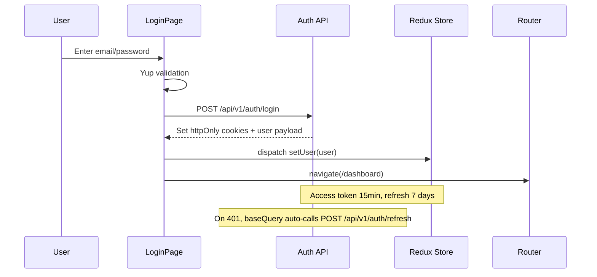
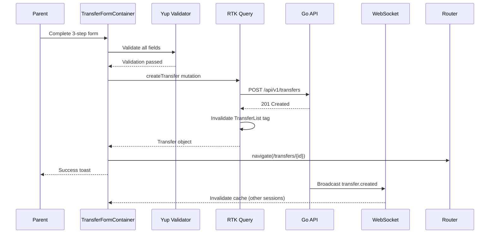
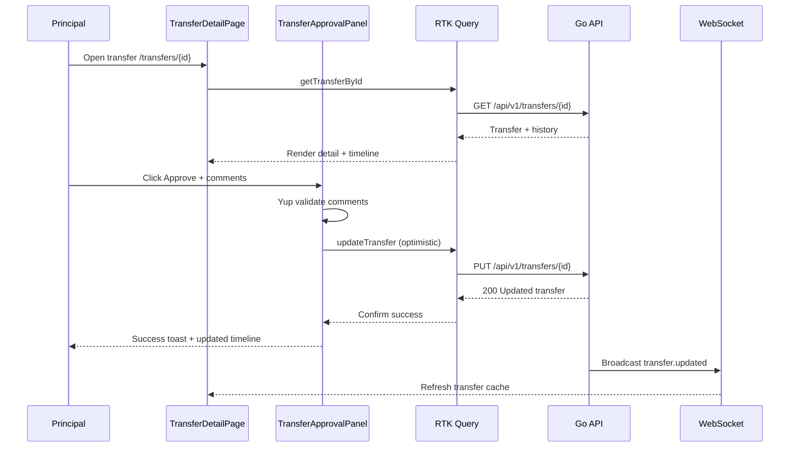
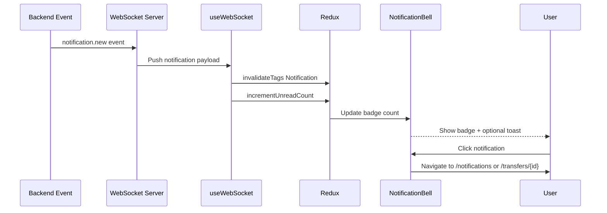
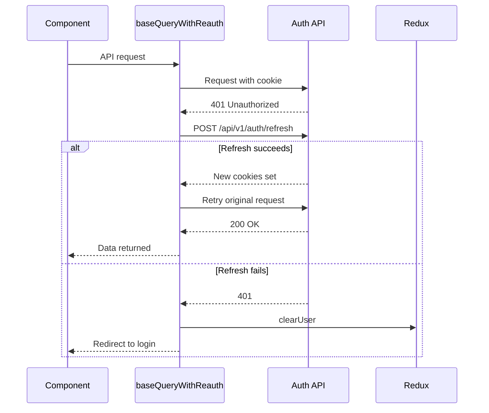

# Low Level Design - Frontend_Development_Phase_1 - Frontend Development Phase

Reference HLD: hld/hld_Frontend_Development_Phase_1.md

## 1. Overview

### 1.1. Objective
This LLD provides implementation-ready specifications for the NTUC First Campus transfer request platform frontend. The design transforms the approved high-level React SPA architecture into concrete TypeScript interfaces, component hierarchies, Redux Toolkit store configuration, RTK Query API slices, routing guards, form validation schemas, WebSocket integration, and detailed implementation guidelines. The frontend delivers responsive Parent and Staff portals for transfer submission, real-time status tracking, principal approval workflows, notification management, and self-service help.

### 1.2. Scope
This LLD covers:
- React 18 SPA project structure (Vite build)
- Parent Portal and Staff/Principal Portal layouts
- Authentication flow with JWT (httpOnly cookies + refresh)
- Transfer request forms, lists, detail views, and status timeline
- Principal dashboard with approval/rejection workflows
- Notification center and real-time WebSocket updates
- User profile management
- Help center shell (content loaded from API)
- Role-based route and component guards
- Form validation (React Hook Form + Yup)
- State management (Redux Toolkit + RTK Query)
- Accessibility (WCAG 2.1 AA), performance, and error handling

**Out of scope:** Backend API implementation, database design, native mobile apps, infrastructure/deployment (see `lld/lld_Deployment_Release_Phase_1.md`).

### 1.3. Reference Documents
| Document | Purpose |
|----------|---------|
| `hld/hld_Frontend_Development_Phase_1.md` | Source HLD |
| `lld/lld_Backend_Development_Phase_1.md` | API contracts, validation rules, data models |
| `hld/hld_UIUX_Design_Phase_1.md` | Screen flows, design system, accessibility |
| `hld/hld_Role_Based_Access_Control_1.md` | RBAC model, permission guards |
| `user_stories/user_story_Frontend_Development_Phase_1.md` | Acceptance criteria |

### 1.4. Design Decisions (HLD Conflict Resolution)
| Topic | HLD Reference | LLD Decision | Rationale |
|-------|---------------|--------------|-----------|
| Server state | RTK Query (§2.3) | RTK Query | Align with approved HLD; backend LLD §4 incorrectly references React Query |
| Token storage | httpOnly cookies (§8.1) vs localStorage (§5.1) | httpOnly cookies for access/refresh tokens | XSS mitigation; only non-sensitive prefs in localStorage |
| Real-time | WebSocket + Socket.io (§4.2) | Native WebSocket (`/ws/v1/notifications`) | Backend uses WebSocket broadcast; no Socket.io dependency |
| IE11 constraint | Listed in §11.2 | Not supported | React 18 + Vite do not support IE11; document as explicit exclusion |
| Portals | Parent + Staff (§1.2) | Single SPA, role-based layouts | Shared codebase with `ParentLayout` and `StaffLayout` |

## 2. Detailed Component Design

### 2.1. Component Breakdown
| Component | Type | Responsibility | Portal | New/Existing |
|-----------|------|---------------|--------|--------------|
| App | Root | Providers, error boundary, theme | Both | New |
| AuthProvider | Context | Session state, token refresh | Both | New |
| PermissionProvider | Context | RBAC permission evaluation | Both | New |
| ParentLayout | Layout | Parent navigation, header, footer | Parent | New |
| StaffLayout | Layout | Staff sidebar, principal tools | Staff | New |
| LoginPage | Page | AD-backed login form | Both | New |
| DashboardPage | Page | Role-specific overview | Both | New |
| TransferListPage | Page | Paginated transfer list with filters | Both | New |
| TransferFormPage | Page | Multi-step transfer submission | Parent | New |
| TransferDetailPage | Page | Transfer detail + status timeline | Both | New |
| TransferApprovalPanel | Feature | Approve/reject with comments | Staff | New |
| StatusTimeline | Feature | Visual status history | Both | New |
| NotificationCenterPage | Page | In-app notification list | Both | New |
| NotificationBell | Feature | Header badge + dropdown preview | Both | New |
| ProfilePage | Page | User profile edit | Both | New |
| HelpCenterPage | Page | FAQ search, categories | Both | New |
| ReportsPage | Page | Analytics charts (staff only) | Staff | New |
| ProtectedRoute | Guard | Auth + role route guard | Both | New |
| PermissionGate | Guard | Component-level RBAC | Both | New |
| ErrorBoundary | Utility | Unhandled error fallback UI | Both | New |
| OfflineBanner | Utility | Network status indicator | Both | New |

### 2.2. Component Hierarchy


### 2.3. Portal & Role Matrix
| Role | Layout | Default Route | Visible Nav Items |
|------|--------|---------------|-------------------|
| parent | ParentLayout | `/dashboard` | Dashboard, My Transfers, New Transfer, Notifications, Profile, Help |
| guardian | ParentLayout | `/dashboard` | Same as parent |
| teacher | StaffLayout | `/dashboard` | Dashboard, Transfers, Notifications, Profile, Help |
| principal | StaffLayout | `/dashboard` | Dashboard, Transfers, Approvals, Reports, Notifications, Profile, Help |
| hq_staff | StaffLayout | `/dashboard` | Dashboard, Transfers, Reports, Notifications, Profile, Help |
| admin | StaffLayout | `/dashboard` | All staff items (future RBAC admin routes out of Phase 1 scope) |

### 2.4. Permission Matrix (UI Actions)
| Permission | Roles | UI Element |
|------------|-------|------------|
| `view_transfer` | parent, guardian, teacher, principal, hq_staff | Transfer list, detail view |
| `create_transfer` | parent, guardian | New Transfer nav, submit button |
| `edit_transfer` | parent, guardian | Edit own pending transfers |
| `cancel_transfer` | parent, guardian | Cancel own pending transfers |
| `approve_transfer` | principal | Approve button on detail/approval panel |
| `reject_transfer` | principal | Reject button on detail/approval panel |
| `view_reports` | principal, hq_staff | Reports nav item |
| `view_all_transfers` | teacher, principal, hq_staff | Centre-scoped transfer list |
| `manage_notifications` | all authenticated | Notification center |

## 3. Frontend Low-Level Design (React)

### 3.1. Project Setup
| Item | Value |
|------|-------|
| Package manager | npm |
| Build tool | Vite 5.x |
| Language | TypeScript 5.x |
| React | 18.x |
| Node | 20 LTS |

**Key dependencies:**
```json
{
  "dependencies": {
    "@mui/material": "^5.x",
    "@mui/icons-material": "^5.x",
    "@reduxjs/toolkit": "^2.x",
    "react": "^18.x",
    "react-dom": "^18.x",
    "react-hook-form": "^7.x",
    "react-redux": "^9.x",
    "react-router-dom": "^6.x",
    "@hookform/resolvers": "^3.x",
    "yup": "^1.x",
    "recharts": "^2.x",
    "date-fns": "^3.x"
  },
  "devDependencies": {
    "@testing-library/react": "^14.x",
    "@testing-library/jest-dom": "^6.x",
    "@testing-library/user-event": "^14.x",
    "vitest": "^1.x",
    "@vitejs/plugin-react": "^4.x",
    "typescript": "^5.x",
    "eslint": "^8.x",
    "prettier": "^3.x"
  }
}
```

### 3.2. Folder Structure
```
frontend/
├── public/
│   ├── manifest.json          # PWA manifest
│   └── icons/
├── src/
│   ├── app/
│   │   ├── App.tsx
│   │   ├── router.tsx
│   │   └── store.ts
│   ├── components/
│   │   ├── common/            # Button, LoadingSpinner, EmptyState, ErrorAlert
│   │   ├── forms/             # FormField, DatePickerField, CentreSelect
│   │   ├── layout/            # ParentLayout, StaffLayout, Header, Sidebar, Footer
│   │   ├── guards/            # ProtectedRoute, PermissionGate, GuestGuard
│   │   ├── transfers/         # TransferTable, FilterPanel, StatusTimeline, ApprovalPanel
│   │   ├── notifications/     # NotificationBell, NotificationList, NotificationItem
│   │   ├── dashboard/         # StatusCards, RecentTransfers, StatsChart
│   │   └── ui/                # Atomic MUI wrappers (NtfcButton, NtfcTextField)
│   ├── pages/
│   │   ├── Auth/
│   │   │   └── LoginPage.tsx
│   │   ├── Dashboard/
│   │   │   └── DashboardPage.tsx
│   │   ├── Transfers/
│   │   │   ├── TransferListPage.tsx
│   │   │   ├── TransferFormPage.tsx
│   │   │   └── TransferDetailPage.tsx
│   │   ├── Profile/
│   │   │   └── ProfilePage.tsx
│   │   ├── Notifications/
│   │   │   └── NotificationCenterPage.tsx
│   │   ├── Reports/
│   │   │   └── ReportsPage.tsx
│   │   └── Help/
│   │       └── HelpCenterPage.tsx
│   ├── features/              # Container components (smart)
│   │   ├── auth/
│   │   ├── transfers/
│   │   ├── notifications/
│   │   └── dashboard/
│   ├── hooks/
│   │   ├── useAuth.ts
│   │   ├── usePermissions.ts
│   │   ├── useWebSocket.ts
│   │   ├── useOfflineStatus.ts
│   │   └── useDebounce.ts
│   ├── services/
│   │   ├── baseQuery.ts       # RTK Query fetchBaseQuery + interceptors
│   │   └── websocket.ts       # WebSocket client singleton
│   ├── store/
│   │   ├── index.ts
│   │   ├── slices/
│   │   │   ├── authSlice.ts
│   │   │   └── uiSlice.ts
│   │   └── api/
│   │       ├── authApi.ts
│   │       ├── transferApi.ts
│   │       ├── userApi.ts
│   │       ├── notificationApi.ts
│   │       ├── centreApi.ts
│   │       └── reportApi.ts
│   ├── types/
│   │   ├── auth.ts
│   │   ├── transfer.ts
│   │   ├── user.ts
│   │   ├── notification.ts
│   │   └── api.ts
│   ├── utils/
│   │   ├── constants.ts
│   │   ├── helpers.ts
│   │   ├── validators.ts      # Yup schemas
│   │   └── permissions.ts
│   ├── styles/
│   │   ├── theme.ts           # MUI theme (NTFC design tokens)
│   │   └── globals.css
│   ├── providers/
│   │   ├── AuthProvider.tsx
│   │   └── PermissionProvider.tsx
│   └── main.tsx
├── index.html
├── vite.config.ts
├── tsconfig.json
├── .env.example
└── package.json
```

### 3.3. TypeScript Data Structures

#### 3.3.1 Auth Types
```typescript
// src/types/auth.ts
export interface LoginRequest {
  email: string;
  password: string;
}

export interface AuthUser {
  id: string;
  email: string;
  firstName: string;
  lastName: string;
  roles: UserRole[];
}

export interface UserRole {
  id: string;
  roleName: 'parent' | 'guardian' | 'teacher' | 'principal' | 'hq_staff' | 'admin';
  centreId?: string;
  permissions: string[];
}

export interface AuthState {
  user: AuthUser | null;
  isAuthenticated: boolean;
  isLoading: boolean;
}
```

#### 3.3.2 Transfer Types
```typescript
// src/types/transfer.ts
export type TransferStatus =
  | 'pending'
  | 'under_review'
  | 'approved'
  | 'rejected'
  | 'cancelled';

export type TransferPriority = 'low' | 'normal' | 'high' | 'urgent';

export interface Transfer {
  id: string;
  userId: string;
  fromCentreId: string;
  toCentreId: string;
  fromCentreName?: string;
  toCentreName?: string;
  childName: string;
  childAge: number;
  preferredStartDate: string;
  status: TransferStatus;
  priority: TransferPriority;
  reason?: string;
  submittedAt: string;
  updatedAt: string;
  statusHistory?: StatusHistoryEntry[];
  documents?: TransferDocument[];
}

export interface StatusHistoryEntry {
  id: string;
  status: TransferStatus;
  comments?: string;
  changedBy: string;
  changedByName?: string;
  changedAt: string;
}

export interface TransferDocument {
  id: string;
  fileName: string;
  fileSize: number;
  mimeType: string;
  uploadedAt: string;
}

export interface CreateTransferRequest {
  fromCentreId: string;
  toCentreId: string;
  childName: string;
  childAge: number;
  preferredStartDate: string;
  priority: TransferPriority;
  reason?: string;
}

export interface UpdateTransferRequest {
  status?: 'approved' | 'rejected' | 'cancelled';
  comments?: string;
  preferredStartDate?: string;
}

export interface TransferListParams {
  status?: TransferStatus;
  centreId?: string;
  priority?: TransferPriority;
  dateFrom?: string;
  dateTo?: string;
  limit?: number;
  offset?: number;
}

export interface TransferListResponse {
  transfers: Transfer[];
  total: number;
  limit: number;
  offset: number;
}
```

#### 3.3.3 User & Notification Types
```typescript
// src/types/user.ts
export interface UserProfile {
  id: string;
  email: string;
  firstName: string;
  lastName: string;
  phone?: string;
  status: string;
  roles: UserRole[];
}

export interface UpdateProfileRequest {
  firstName: string;
  lastName: string;
  phone?: string;
}

// src/types/notification.ts
export interface Notification {
  id: string;
  userId: string;
  type: string;
  title: string;
  message: string;
  read: boolean;
  createdAt: string;
  readAt?: string;
  data?: Record<string, unknown>;
}

export interface NotificationListParams {
  status?: 'read' | 'unread';
  type?: string;
  limit?: number;
  offset?: number;
}

// src/types/api.ts
export interface ApiResponse<T> {
  success: boolean;
  data: T;
}

export interface ApiError {
  success: false;
  error: {
    code: string;
    message: string;
    details?: Record<string, string>;
  };
}
```

### 3.4. Redux Store Configuration

#### 3.4.1 Store Setup
```typescript
// src/app/store.ts
import { configureStore } from '@reduxjs/toolkit';
import { setupListeners } from '@reduxjs/toolkit/query';
import authReducer from '../store/slices/authSlice';
import uiReducer from '../store/slices/uiSlice';
import { authApi } from '../store/api/authApi';
import { transferApi } from '../store/api/transferApi';
import { userApi } from '../store/api/userApi';
import { notificationApi } from '../store/api/notificationApi';
import { centreApi } from '../store/api/centreApi';
import { reportApi } from '../store/api/reportApi';

export const store = configureStore({
  reducer: {
    auth: authReducer,
    ui: uiReducer,
    [authApi.reducerPath]: authApi.reducer,
    [transferApi.reducerPath]: transferApi.reducer,
    [userApi.reducerPath]: userApi.reducer,
    [notificationApi.reducerPath]: notificationApi.reducer,
    [centreApi.reducerPath]: centreApi.reducer,
    [reportApi.reducerPath]: reportApi.reducer,
  },
  middleware: (getDefaultMiddleware) =>
    getDefaultMiddleware().concat(
      authApi.middleware,
      transferApi.middleware,
      userApi.middleware,
      notificationApi.middleware,
      centreApi.middleware,
      reportApi.middleware,
    ),
});

setupListeners(store.dispatch);

export type RootState = ReturnType<typeof store.getState>;
export type AppDispatch = typeof store.dispatch;
```

#### 3.4.2 Auth Slice
```typescript
// src/store/slices/authSlice.ts
import { createSlice, PayloadAction } from '@reduxjs/toolkit';
import type { AuthUser } from '../../types/auth';

interface AuthSliceState {
  user: AuthUser | null;
  isAuthenticated: boolean;
}

const initialState: AuthSliceState = {
  user: null,
  isAuthenticated: false,
};

const authSlice = createSlice({
  name: 'auth',
  initialState,
  reducers: {
    setUser(state, action: PayloadAction<AuthUser>) {
      state.user = action.payload;
      state.isAuthenticated = true;
    },
    clearUser(state) {
      state.user = null;
      state.isAuthenticated = false;
    },
  },
});

export const { setUser, clearUser } = authSlice.actions;
export default authSlice.reducer;
```

#### 3.4.3 UI Slice
```typescript
// src/store/slices/uiSlice.ts
interface UiSliceState {
  sidebarOpen: boolean;
  unreadNotificationCount: number;
  globalError: string | null;
  isOffline: boolean;
}
// reducers: toggleSidebar, setUnreadCount, setGlobalError, setOffline
```

### 3.5. RTK Query API Slices

#### 3.5.1 Base Query with Credentials
```typescript
// src/services/baseQuery.ts
import { fetchBaseQuery } from '@reduxjs/toolkit/query/react';
import type { BaseQueryFn, FetchArgs, FetchBaseQueryError } from '@reduxjs/toolkit/query';

const rawBaseQuery = fetchBaseQuery({
  baseUrl: import.meta.env.VITE_API_BASE_URL,
  credentials: 'include', // httpOnly cookie auth
  prepareHeaders: (headers) => {
    headers.set('Accept', 'application/json');
    return headers;
  },
});

export const baseQueryWithReauth: BaseQueryFn<
  string | FetchArgs,
  unknown,
  FetchBaseQueryError
> = async (args, api, extraOptions) => {
  let result = await rawBaseQuery(args, api, extraOptions);

  if (result.error?.status === 401) {
    const refreshResult = await rawBaseQuery(
      { url: '/api/v1/auth/refresh', method: 'POST' },
      api,
      extraOptions,
    );
    if (refreshResult.data) {
      result = await rawBaseQuery(args, api, extraOptions);
    } else {
      api.dispatch({ type: 'auth/clearUser' });
    }
  }
  return result;
};
```

#### 3.5.2 Transfer API
```typescript
// src/store/api/transferApi.ts
import { createApi } from '@reduxjs/toolkit/query/react';
import { baseQueryWithReauth } from '../../services/baseQuery';
import type {
  Transfer,
  CreateTransferRequest,
  UpdateTransferRequest,
  TransferListParams,
  TransferListResponse,
  ApiResponse,
} from '../../types';

export const transferApi = createApi({
  reducerPath: 'transferApi',
  baseQuery: baseQueryWithReauth,
  tagTypes: ['Transfer', 'TransferList', 'TransferStats'],
  endpoints: (builder) => ({
    getTransfers: builder.query<TransferListResponse, TransferListParams | void>({
      query: (params) => ({ url: '/api/v1/transfers', params: params ?? {} }),
      transformResponse: (response: ApiResponse<TransferListResponse>) => response.data,
      providesTags: (result) =>
        result
          ? [
              ...result.transfers.map(({ id }) => ({ type: 'Transfer' as const, id })),
              { type: 'TransferList', id: 'LIST' },
            ]
          : [{ type: 'TransferList', id: 'LIST' }],
    }),
    getTransferById: builder.query<Transfer, string>({
      query: (id) => `/api/v1/transfers/${id}`,
      transformResponse: (response: ApiResponse<Transfer>) => response.data,
      providesTags: (_result, _error, id) => [{ type: 'Transfer', id }],
    }),
    createTransfer: builder.mutation<Transfer, CreateTransferRequest>({
      query: (body) => ({ url: '/api/v1/transfers', method: 'POST', body }),
      transformResponse: (response: ApiResponse<Transfer>) => response.data,
      invalidatesTags: [{ type: 'TransferList', id: 'LIST' }, 'TransferStats'],
    }),
    updateTransfer: builder.mutation<
      Transfer,
      { id: string; body: UpdateTransferRequest }
    >({
      query: ({ id, body }) => ({ url: `/api/v1/transfers/${id}`, method: 'PUT', body }),
      transformResponse: (response: ApiResponse<Transfer>) => response.data,
      async onQueryStarted({ id, body }, { dispatch, queryFulfilled }) {
        const patchResult = dispatch(
          transferApi.util.updateQueryData('getTransferById', id, (draft) => {
            if (body.status) draft.status = body.status;
          }),
        );
        try {
          await queryFulfilled;
        } catch {
          patchResult.undo();
        }
      },
      invalidatesTags: (_result, _error, { id }) => [
        { type: 'Transfer', id },
        { type: 'TransferList', id: 'LIST' },
        'TransferStats',
      ],
    }),
    getTransferStats: builder.query<TransferStats, void>({
      query: () => '/api/v1/transfers/stats',
      transformResponse: (response: ApiResponse<TransferStats>) => response.data,
      providesTags: ['TransferStats'],
    }),
  }),
});
```

#### 3.5.3 API Integration Summary
| Slice | Endpoint | Method | Hook | Cache Tags |
|-------|----------|--------|------|------------|
| authApi | `/api/v1/auth/login` | POST | `useLoginMutation` | — |
| authApi | `/api/v1/auth/logout` | POST | `useLogoutMutation` | — |
| authApi | `/api/v1/auth/refresh` | POST | — (baseQuery) | — |
| authApi | `/api/v1/auth/me` | GET | `useGetMeQuery` | `Auth` |
| transferApi | `/api/v1/transfers` | GET | `useGetTransfersQuery` | `TransferList` |
| transferApi | `/api/v1/transfers/{id}` | GET | `useGetTransferByIdQuery` | `Transfer` |
| transferApi | `/api/v1/transfers` | POST | `useCreateTransferMutation` | invalidates list |
| transferApi | `/api/v1/transfers/{id}` | PUT | `useUpdateTransferMutation` | optimistic update |
| transferApi | `/api/v1/transfers/stats` | GET | `useGetTransferStatsQuery` | `TransferStats` |
| userApi | `/api/v1/users/profile` | GET | `useGetProfileQuery` | `Profile` |
| userApi | `/api/v1/users/profile` | PUT | `useUpdateProfileMutation` | `Profile` |
| notificationApi | `/api/v1/notifications` | GET | `useGetNotificationsQuery` | `Notification` |
| notificationApi | `/api/v1/notifications/{id}/read` | PUT | `useMarkNotificationReadMutation` | optimistic |
| centreApi | `/api/v1/centres` | GET | `useGetCentresQuery` | `Centre` |
| reportApi | `/api/v1/reports` | GET | `useGetReportsQuery` | `Report` |

**Cache policy:** Default `keepUnusedDataFor: 300` (5 minutes). Transfer detail refetches on WebSocket `transfer.updated` event.

### 3.6. Custom Hooks

#### 3.6.1 useAuth
```typescript
// src/hooks/useAuth.ts
export function useAuth() {
  const dispatch = useAppDispatch();
  const { user, isAuthenticated } = useAppSelector((state) => state.auth);
  const [login, { isLoading: isLoggingIn }] = useLoginMutation();
  const [logout] = useLogoutMutation();
  const { data: me, isLoading: isLoadingMe } = useGetMeQuery(undefined, {
    skip: !isAuthenticated,
  });

  const handleLogin = async (credentials: LoginRequest) => {
    const result = await login(credentials).unwrap();
    dispatch(setUser(result.user));
    return result;
  };

  const handleLogout = async () => {
    await logout().unwrap();
    dispatch(clearUser());
  };

  const primaryRole = user?.roles[0]?.roleName ?? null;
  const isParentPortal = primaryRole === 'parent' || primaryRole === 'guardian';

  return {
    user,
    isAuthenticated,
    isLoading: isLoggingIn || isLoadingMe,
    primaryRole,
    isParentPortal,
    login: handleLogin,
    logout: handleLogout,
  };
}
```

#### 3.6.2 usePermissions
```typescript
// src/hooks/usePermissions.ts
export function usePermissions() {
  const { user } = useAuth();

  const permissions = useMemo(
    () => new Set(user?.roles.flatMap((r) => r.permissions) ?? []),
    [user],
  );

  const hasPermission = (permission: string) => permissions.has(permission);
  const hasAnyPermission = (...perms: string[]) => perms.some(hasPermission);
  const hasRole = (role: string) => user?.roles.some((r) => r.roleName === role) ?? false;

  return { hasPermission, hasAnyPermission, hasRole, permissions };
}
```

#### 3.6.3 useWebSocket
```typescript
// src/hooks/useWebSocket.ts
export function useWebSocket() {
  const dispatch = useAppDispatch();
  const { isAuthenticated, user } = useAuth();

  useEffect(() => {
    if (!isAuthenticated || !user) return;

    const ws = getWebSocketClient(`${import.meta.env.VITE_WS_URL}/ws/v1/notifications`);

    ws.on('notification.new', (payload: Notification) => {
      dispatch(notificationApi.util.invalidateTags(['Notification']));
      dispatch(uiSlice.actions.incrementUnreadCount());
    });

    ws.on('transfer.updated', (payload: { transferId: string }) => {
      dispatch(
        transferApi.util.invalidateTags([
          { type: 'Transfer', id: payload.transferId },
          { type: 'TransferList', id: 'LIST' },
        ]),
      );
    });

    return () => ws.disconnect();
  }, [isAuthenticated, user?.id, dispatch]);
}
```

### 3.7. Routing Configuration

#### 3.7.1 Route Table
| Route | Page Component | Guard | Layout | Roles |
|-------|---------------|-------|--------|-------|
| `/login` | LoginPage | GuestGuard | None | public |
| `/` | Redirect | AuthGuard | — | redirects to `/dashboard` |
| `/dashboard` | DashboardPage | AuthGuard | dynamic | all |
| `/transfers` | TransferListPage | AuthGuard + `view_transfer` | dynamic | all |
| `/transfers/new` | TransferFormPage | AuthGuard + `create_transfer` | ParentLayout | parent, guardian |
| `/transfers/:id` | TransferDetailPage | AuthGuard + `view_transfer` | dynamic | all |
| `/transfers/:id/edit` | TransferFormPage | AuthGuard + `edit_transfer` | ParentLayout | parent, guardian |
| `/notifications` | NotificationCenterPage | AuthGuard | dynamic | all |
| `/profile` | ProfilePage | AuthGuard | dynamic | all |
| `/reports` | ReportsPage | AuthGuard + `view_reports` | StaffLayout | principal, hq_staff |
| `/help` | HelpCenterPage | AuthGuard | dynamic | all |
| `*` | NotFoundPage | — | None | public |

#### 3.7.2 Router Implementation
```typescript
// src/app/router.tsx
const router = createBrowserRouter([
  { path: '/login', element: <GuestGuard><LoginPage /></GuestGuard> },
  {
    element: <ProtectedRoute />,
    children: [
      {
        element: <PortalLayout />, // selects ParentLayout or StaffLayout
        children: [
          { path: '/dashboard', element: <DashboardPage /> },
          { path: '/transfers', element: <TransferListPage /> },
          { path: '/transfers/new', element: <PermissionGate permission="create_transfer"><TransferFormPage /></PermissionGate> },
          { path: '/transfers/:id', element: <TransferDetailPage /> },
          { path: '/transfers/:id/edit', element: <PermissionGate permission="edit_transfer"><TransferFormPage /></PermissionGate> },
          { path: '/notifications', element: <NotificationCenterPage /> },
          { path: '/profile', element: <ProfilePage /> },
          { path: '/reports', element: <PermissionGate permission="view_reports"><ReportsPage /></PermissionGate> },
          { path: '/help', element: <HelpCenterPage /> },
        ],
      },
    ],
  },
  { path: '*', element: <NotFoundPage /> },
]);
```

**Code splitting:** All page components loaded via `React.lazy()` with `Suspense` fallback (`LoadingSpinner`).

### 3.8. Component Specifications

#### 3.8.1 Page & Container Components
| Component | Props | State/Hooks | Events | API Calls |
|-----------|-------|-------------|--------|-----------|
| LoginPage | — | `useAuth`, react-hook-form | onSubmit | POST `/api/v1/auth/login` |
| DashboardPage | — | `useGetTransferStatsQuery`, `useGetTransfersQuery` | onQuickAction | GET stats, GET recent transfers |
| TransferListContainer | — | `useGetTransfersQuery`, local filter state | onFilterChange, onPageChange, onRowClick | GET `/api/v1/transfers` |
| TransferFormContainer | `{ transferId? }` | react-hook-form, `useCreateTransferMutation` / `useUpdateTransferMutation` | onStepNext, onSubmit | POST/PUT transfers |
| TransferDetailContainer | `{ transferId }` | `useGetTransferByIdQuery` | onCancel, onEdit | GET transfer by id |
| TransferApprovalPanel | `{ transfer }` | local comments state | onApprove, onReject | PUT `/api/v1/transfers/{id}` |
| StatusTimeline | `{ history }` | — | — | — |
| NotificationCenterPage | — | `useGetNotificationsQuery` | onMarkRead, onFilter | GET/PUT notifications |
| NotificationBell | — | `useGetNotificationsQuery`, uiSlice unread count | onOpen, onMarkRead | GET notifications (limit 5) |
| ProfilePage | — | react-hook-form, `useGetProfileQuery`, `useUpdateProfileMutation` | onSubmit | GET/PUT profile |
| ReportsPage | — | `useGetReportsQuery`, Recharts | onDateRangeChange | GET `/api/v1/reports` |
| HelpCenterPage | — | local search state | onSearch, onCategorySelect | GET `/api/v1/help` (future) |

#### 3.8.2 Presentational Components
| Component | Props | Notes |
|-----------|-------|-------|
| TransferTable | `transfers`, `onRowClick`, `loading` | MUI DataGrid, sortable columns, accessible row actions |
| FilterPanel | `filters`, `onChange`, `onReset` | Status, priority, date range, centre (staff) |
| StatusCards | `stats` | Pending, approved, rejected counts |
| TransferStepIndicator | `activeStep`, `steps` | 3-step form: Centre → Child → Review |
| CentreSelectionStep | `control`, `errors`, `centres` | Autocomplete for from/to centre |
| EmptyState | `title`, `message`, `action` | Used when no transfers/notifications |
| ErrorAlert | `error`, `onRetry` | Maps API error codes to user messages |

### 3.9. Form Validation (Yup Schemas)

```typescript
// src/utils/validators.ts
import * as yup from 'yup';

export const loginSchema = yup.object({
  email: yup.string().email('Valid email address is required').required('Email is required'),
  password: yup.string().required('Password is required'),
});

export const transferFormSchema = yup.object({
  fromCentreId: yup.string().uuid('Invalid centre').required('Please select source centre'),
  toCentreId: yup
    .string()
    .uuid('Invalid centre')
    .required('Please select destination centre')
    .test('different-centres', 'Destination must differ from source', function (value) {
      return value !== this.parent.fromCentreId;
    }),
  childName: yup
    .string()
    .trim()
    .min(2, 'Child name must be at least 2 characters')
    .max(255, 'Child name must not exceed 255 characters')
    .matches(/^[a-zA-Z\s'-]+$/, 'Child name must contain only letters')
    .required('Child name is required'),
  childAge: yup
    .number()
    .integer('Age must be a whole number')
    .min(0, 'Child age must be between 0 and 18')
    .max(18, 'Child age must be between 0 and 18')
    .required('Child age is required'),
  preferredStartDate: yup
    .date()
    .min(new Date(), 'Please select a future date')
    .required('Preferred start date is required'),
  priority: yup
    .string()
    .oneOf(['low', 'normal', 'high', 'urgent'], 'Please select priority level')
    .required('Priority is required'),
  reason: yup.string().max(1000, 'Reason must not exceed 1000 characters').optional(),
});

export const profileSchema = yup.object({
  firstName: yup.string().trim().min(1).max(100).required('First name is required'),
  lastName: yup.string().trim().min(1).max(100).required('Last name is required'),
  phone: yup
    .string()
    .matches(/^\+?[0-9\s-]{8,20}$/, 'Phone number must be in valid format')
    .optional(),
});

export const approvalSchema = yup.object({
  comments: yup.string().max(500, 'Comments must not exceed 500 characters').optional(),
});
```

#### 3.9.1 Field Validation Mapping (Backend Alignment)
| Field | Client Rule | Server Rule (Backend LLD §3.6) | Error Message |
|-------|-------------|--------------------------------|---------------|
| from_centre_id | Required UUID | Required UUID | "Please select source centre" |
| to_centre_id | Required, ≠ from | Required, different UUID | "Please select different destination centre" |
| child_name | 2–255 chars, alphabetic | Same | "Child name is required (2–255 characters)" |
| child_age | 0–18 integer | Same | "Child age must be between 0 and 18" |
| preferred_start_date | Future date | Future date | "Please select a future date" |
| priority | low/normal/high/urgent | Same enum | "Please select priority level" |
| reason | Max 1000 chars | Optional max 1000 | "Reason must not exceed 1000 characters" |

### 3.10. Error Handling

#### 3.10.1 API Error Code Mapping
| Backend Code | HTTP Status | UI Behavior |
|--------------|-------------|-------------|
| `VALIDATION_ERROR` | 400 | Inline field errors from `details` map |
| `UNAUTHORIZED` | 401 | Redirect to `/login`, clear auth state |
| `FORBIDDEN` | 403 | Show "Access denied" page |
| `NOT_FOUND` | 404 | Show not-found state with back link |
| `CONFLICT` | 409 | Toast: "A similar transfer already exists" |
| `RATE_LIMITED` | 429 | Toast with retry countdown |
| `INTERNAL_ERROR` | 500 | ErrorAlert with retry button |
| `SERVICE_UNAVAILABLE` | 503 | OfflineBanner + queued retry |

#### 3.10.2 Error Boundary
```typescript
// src/components/common/ErrorBoundary.tsx
// Catches render errors, logs to Sentry, shows fallback with "Reload page" action
// Wraps entire app in App.tsx
```

### 3.11. Authentication Flow



**Session timeout:** Display warning modal 2 minutes before token expiry; auto-logout on refresh failure.

### 3.12. WebSocket Integration

```typescript
// src/services/websocket.ts
type WebSocketEvent = 'notification.new' | 'transfer.updated' | 'ping';

class WebSocketClient {
  private ws: WebSocket | null = null;
  private reconnectAttempts = 0;
  private maxReconnectAttempts = 5;
  private listeners: Map<WebSocketEvent, Set<(payload: unknown) => void>>;

  connect(url: string): void {
    this.ws = new WebSocket(url); // cookies sent automatically (same origin)
    this.ws.onmessage = (event) => {
      const { type, payload } = JSON.parse(event.data);
      this.emit(type, payload);
    };
    this.ws.onclose = () => this.scheduleReconnect();
  }

  on(event: WebSocketEvent, handler: (payload: unknown) => void): void { /* ... */ }
  disconnect(): void { /* ... */ }
}
```

**Reconnection:** Exponential backoff (1s, 2s, 4s, 8s, 16s). Show subtle reconnect indicator in header.

### 3.13. MUI Theme & Accessibility

```typescript
// src/styles/theme.ts
export const theme = createTheme({
  palette: {
    primary: { main: '#003DA5' },    // NTFC brand blue (from UI/UX HLD)
    secondary: { main: '#E87722' },
    error: { main: '#D32F2F' },
    background: { default: '#F5F5F5', paper: '#FFFFFF' },
  },
  typography: {
    fontFamily: '"Open Sans", "Roboto", "Helvetica", "Arial", sans-serif',
  },
  components: {
    MuiButton: { defaultProps: { disableElevation: true } },
    MuiTextField: { defaultProps: { variant: 'outlined', size: 'medium' } },
  },
});
```

**WCAG 2.1 AA requirements:**
- Minimum contrast ratio 4.5:1 for normal text
- All interactive elements keyboard-accessible (Tab order, Enter/Space activation)
- `aria-label` on icon-only buttons (NotificationBell, sidebar toggle)
- Form fields linked via `htmlFor` / `id`; errors announced via `aria-describedby`
- Focus visible styles on all focusable elements
- Skip-to-main-content link in layouts
- Responsive breakpoints: xs (<600), sm (600), md (900), lg (1200), xl (1536)

### 3.14. Environment Configuration
| Variable | Example | Purpose |
|----------|---------|---------|
| `VITE_API_BASE_URL` | `https://api.ntfc.example.com` | REST API base URL |
| `VITE_WS_URL` | `wss://api.ntfc.example.com` | WebSocket base URL |
| `VITE_APP_ENV` | `development` | Environment label |
| `VITE_SENTRY_DSN` | `https://...` | Error tracking (production) |
| `VITE_GA_MEASUREMENT_ID` | `G-XXXX` | Google Analytics |

## 4. Backend Integration Contract

Frontend consumes APIs defined in `lld/lld_Backend_Development_Phase_1.md` §3.4. Key contracts:

### 4.1. Transfer Endpoints
| Action | Method | Path | Request | Success Response |
|--------|--------|------|---------|------------------|
| List transfers | GET | `/api/v1/transfers` | Query: status, centre_id, priority, date_from, date_to, limit, offset | `{ success, data: { transfers, total, limit, offset } }` |
| Get transfer | GET | `/api/v1/transfers/{id}` | Path: id | `{ success, data: Transfer }` |
| Create transfer | POST | `/api/v1/transfers` | CreateTransferRequest body | 201 `{ success, data: Transfer }` |
| Update transfer | PUT | `/api/v1/transfers/{id}` | UpdateTransferRequest body | `{ success, data: Transfer }` |

### 4.2. User Endpoints
| Action | Method | Path | Request | Success Response |
|--------|--------|------|---------|------------------|
| Get profile | GET | `/api/v1/users/profile` | — | `{ success, data: UserProfile }` |
| Update profile | PUT | `/api/v1/users/profile` | UpdateProfileRequest | `{ success, data: UserProfile }` |

### 4.3. Notification Endpoints
| Action | Method | Path | Request | Success Response |
|--------|--------|------|---------|------------------|
| List notifications | GET | `/api/v1/notifications` | Query: status, type, limit, offset | `{ success, data: Notification[] }` |
| Mark read | PUT | `/api/v1/notifications/{id}/read` | — | `{ success, data: { message } }` |

### 4.4. Auth Endpoints (Frontend Contract)
| Action | Method | Path | Notes |
|--------|--------|------|-------|
| Login | POST | `/api/v1/auth/login` | Sets httpOnly cookies; returns user + roles |
| Logout | POST | `/api/v1/auth/logout` | Clears cookies |
| Refresh | POST | `/api/v1/auth/refresh` | Called automatically on 401 |
| Current user | GET | `/api/v1/auth/me` | Returns authenticated user on app load |

## 5. Sequence Diagrams

### 5.1. Transfer Submission Flow


### 5.2. Principal Approval Flow


### 5.3. Real-time Notification Flow


### 5.4. Token Refresh Flow


## 6. Acceptance Criteria Mapping

| Acceptance Criterion (User Story) | Implementing Component(s) | Verification |
|-----------------------------------|---------------------------|--------------|
| Responsive web interfaces for Parent and Staff | ParentLayout, StaffLayout, MUI breakpoints | Resize tests xs–xl; no horizontal scroll |
| Transfer request submission | TransferFormPage, TransferFormContainer | Submit valid form → 201 → redirect to detail |
| Dashboard workflows | DashboardPage, StatusCards, RecentTransfers | Role-specific content renders correctly |
| Real-time status tracking | StatusTimeline, useWebSocket, transferApi cache invalidation | Status change via WS updates UI without refresh |
| Notification features | NotificationCenterPage, NotificationBell | New notification increments badge; mark read works |
| Backend API integration | RTK Query slices, baseQueryWithReauth | All CRUD operations against staging API pass |
| Accessibility compliance | Theme, ARIA labels, keyboard nav | axe-core audit: 0 critical violations |
| Usability testing readiness | All Phase 1 screens implemented | UAT script walkthrough completes without blockers |
| Cross-browser compatibility | Chrome, Firefox, Safari, Edge (latest 2 versions) | Manual smoke test checklist |
| Error handling | ErrorBoundary, ErrorAlert, API error mapping | Simulate 400/401/403/500; correct UI response |

## 7. Unit Test Scenarios

| Scenario | Component/Hook | Input | Expected Output | Type |
|----------|---------------|-------|-----------------|------|
| Login with valid credentials | LoginPage | Valid email/password | Navigate to dashboard, user in store | Happy Path |
| Login with invalid email | LoginPage | Invalid email format | Inline validation error | Negative |
| Submit valid transfer form | TransferFormContainer | Valid form data | API called, redirect to detail | Happy Path |
| Submit with same from/to centre | TransferFormContainer | Same centre IDs | Yup error on toCentreId | Negative |
| Submit with past date | TransferFormContainer | Past preferredStartDate | Yup date error | Negative |
| Render transfer list | TransferListContainer | Mock API response | Table renders N rows | Happy Path |
| Filter transfers by status | FilterPanel | status=pending | Query params updated, list refetched | Happy Path |
| Approve transfer as principal | TransferApprovalPanel | Approve + comments | Optimistic update, PUT called | Happy Path |
| Approve button hidden for parent | PermissionGate | role=parent | Approve panel not rendered | RBAC |
| Mark notification read | NotificationCenterPage | Click mark read | Optimistic update, PUT called | Happy Path |
| WebSocket notification received | useWebSocket | notification.new event | Cache invalidated, count incremented | Integration |
| Token refresh on 401 | baseQueryWithReauth | Expired token | Refresh called, request retried | Happy Path |
| Refresh failure redirects login | baseQueryWithReauth | Invalid refresh | clearUser dispatched | Negative |
| Protected route without auth | ProtectedRoute | No user in store | Redirect to /login | Security |
| Reports page blocked for parent | PermissionGate | role=parent, /reports | Access denied UI | RBAC |
| Error boundary catches render error | ErrorBoundary | Throwing child | Fallback UI shown | Edge Case |
| Offline banner shown | OfflineBanner | navigator.onLine=false | Banner visible | Edge Case |
| Profile update valid | ProfilePage | Valid name/phone | PUT called, success toast | Happy Path |
| Empty transfer list | TransferListContainer | Empty API response | EmptyState component shown | Edge Case |
| Dashboard stats load | DashboardPage | Mock stats API | StatusCards render counts | Happy Path |

**Test tooling:** Vitest + React Testing Library. MSW (Mock Service Worker) for API mocking.

## 8. Non-Functional Implementation

### 8.1. Performance
| Requirement (HLD §9.1) | Implementation |
|------------------------|----------------|
| Initial page load < 3s | Code splitting per route; Vite production build; gzip via CDN |
| Route transitions < 500ms | React.lazy + prefetch on nav hover |
| Bundle optimization | Manual chunks: vendor (react, mui), charts (recharts) |
| Image optimization | WebP format, lazy loading via `loading="lazy"` |
| API cache | RTK Query 5-min stale time; background refetch on focus |

**Performance budgets:**
- Main bundle (initial): < 250 KB gzipped
- Per-route chunk: < 100 KB gzipped
- LCP target: < 2.5s on 4G

### 8.2. Security
| Control (HLD §8) | Frontend Implementation |
|------------------|------------------------|
| JWT auth | httpOnly + Secure + SameSite=Strict cookies |
| XSS prevention | React auto-escape; no dangerouslySetInnerHTML |
| CSRF | SameSite cookies; CSRF token header if backend requires |
| Input validation | Yup client-side + server-side error display |
| RBAC | Route guards + PermissionGate component checks |
| CSP | Configured at CDN/Nginx (see deployment LLD) |

### 8.3. Accessibility
- Run `@axe-core/react` in development
- CI gate: `jest-axe` on critical page snapshots
- Screen reader tested flows: login, submit transfer, approve transfer
- Minimum touch target 44×44px on mobile

### 8.4. PWA & Offline
- Service worker via Vite PWA plugin (`vite-plugin-pwa`)
- Cache static assets; network-first for API calls
- OfflineBanner when `navigator.onLine === false`
- Queue failed mutations in IndexedDB (Phase 1: display-only offline state; full queue deferred)

### 8.5. Monitoring & Logging
| Tool | Purpose | Integration Point |
|------|---------|-------------------|
| Sentry | Error tracking | ErrorBoundary, RTK Query error handler |
| Google Analytics | Page views, events | Router navigation listener |
| Web Vitals | LCP, FID, CLS | `web-vitals` library → GA |
| Custom events | Business metrics | `trackEvent('transfer_submitted')` |

## 9. Assumptions, Constraints & Dependencies

### 9.1. Assumptions
- Backend APIs from `lld/lld_Backend_Development_Phase_1.md` are deployed to staging before frontend integration testing
- UI/UX design tokens from `hld/hld_UIUX_Design_Phase_1.md` are finalized; MUI theme approximates Figma specs
- Active Directory credentials work via backend auth proxy (frontend sends email/password to backend only)
- Users have modern browsers (Chrome, Firefox, Safari, Edge — latest 2 major versions)
- WebSocket endpoint available at `/ws/v1/notifications` on same origin as API

### 9.2. Constraints
- Approved stack: React 18, Redux Toolkit, RTK Query, MUI 5, Vite (per HLD §2.3)
- IE11 explicitly not supported (overrides HLD §11.2 ambiguity)
- File upload max 10 MB per document (backend constraint)
- API rate limit: 100 requests/minute per user (display 429 gracefully)
- WCAG 2.1 AA compliance mandatory
- Mobile-first responsive design required

### 9.3. Dependencies
| Dependency | Owner | Required Before |
|------------|-------|-----------------|
| Backend API (transfers, users, notifications) | Backend Team | Integration testing |
| Auth endpoints (login, refresh, logout, me) | Backend Team | Sprint 1 |
| WebSocket notification broadcast | Backend Team | Real-time features |
| Centre list endpoint (`GET /api/v1/centres`) | Backend Team | Transfer form |
| Transfer stats endpoint | Backend Team | Dashboard |
| Reports endpoint | Backend Team | Reports page |
| Figma design system / NTFC brand assets | UX Team | UI polish sprint |
| Staging environment with HTTPS | DevOps Team | E2E testing |
| Sentry project DSN | DevOps Team | Production monitoring |

## 10. Appendix

### 10.1. Glossary
| Term | Definition |
|------|------------|
| SPA | Single Page Application |
| RTK | Redux Toolkit |
| RTK Query | Data fetching and caching layer within Redux Toolkit |
| RBAC | Role-Based Access Control |
| PWA | Progressive Web App |
| WCAG | Web Content Accessibility Guidelines |
| MSW | Mock Service Worker for API mocking in tests |
| LCP | Largest Contentful Paint (Core Web Vital) |

### 10.2. Related LLDs
| LLD | Relationship |
|-----|-------------|
| `lld/lld_Backend_Development_Phase_1.md` | API contracts, validation, data models |
| `lld/lld_Customizable_Notification_Preferences_1.md` | Notification preference UI (Phase 2 integration) |
| `lld/lld_Deployment_Release_Phase_1.md` | CDN, Nginx SPA routing, env vars |

### 10.3. Implementation Phases
| Phase | Deliverables | Duration Estimate |
|-------|-------------|-------------------|
| Sprint 1 | Project scaffold, auth, layouts, routing, theme | 2 weeks |
| Sprint 2 | Transfer form, list, detail, validation | 2 weeks |
| Sprint 3 | Dashboard, approval panel, status timeline | 2 weeks |
| Sprint 4 | Notifications, WebSocket, profile | 1.5 weeks |
| Sprint 5 | Reports, help center, accessibility audit, tests | 1.5 weeks |

**Approval status:** DRAFT
